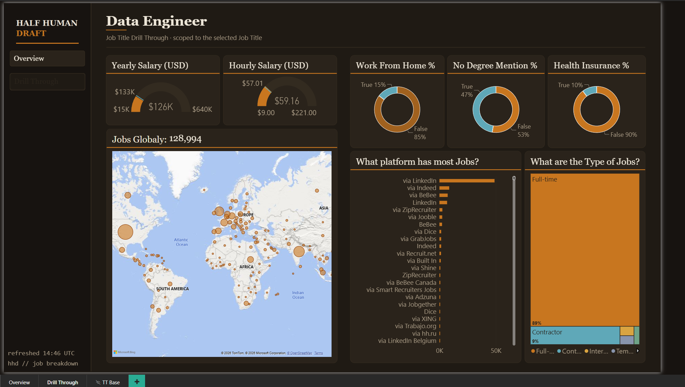
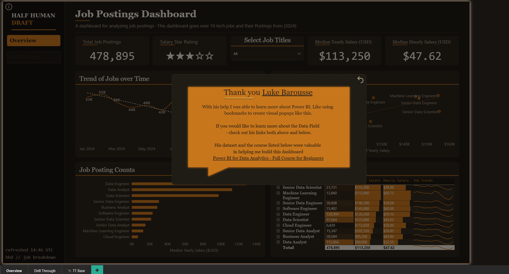

# Job Postings Dashboard

> Part of my [portfolio](https://github.com/Spendry/portfolio).

A Power BI dashboard analyzing **478,895 tech job postings from 2024** across ten data and engineering roles: what they pay, how demand moved through the year, where the jobs are, and which platforms carry them.

## What it answers

- **How did demand move?** Monthly posting counts with a trend line, from the 55K January peak to the 14K November trough and the late-year rebound.
- **What do roles pay?** Median yearly and hourly salary per title, plus a scatter showing how hourly and yearly medians relate across roles.
- **Where is the work?** A global map of postings, scoped to the selected job title.
- **Remote, degree, benefits?** Work-from-home share, "no degree mentioned" share, and health-insurance share per role.
- **Which platforms matter?** Posting counts by source platform and job-type breakdown for the selected role.

## Pages

| Page | What it shows |
|---|---|
| **Overview** | KPI cards (total postings, salary star rating, median yearly and hourly salary), jobs-over-time trend, hourly vs. yearly salary scatter, posting counts by title, and a job stats table with per-role trend sparklines. |
| **Drill Through** | Right-click any job title on the Overview to land here: salary gauges, a global posting map, work-from-home / degree / insurance donuts, platform ranking, and a job-type treemap, all scoped to that title. |
| **TT Base** | Flat Custom tooltip page will be used in the future. |

## Techniques used

- Drill-through navigation scoped to the selected job title
- Bookmark-driven info popup for credits and context
- Custom dark theme (my personal "Half Human Draft" Power BI theme)

## Open it yourself

Download [`job-postings-dashboard.pbix`](job-postings-dashboard.pbix) and open it in [Power BI Desktop](https://powerbi.microsoft.com/desktop/) (free). The data model, measures, and theme all travel with the file.

<!--
  Optional live version: in the Power BI Service, File > Embed report > Publish to web (public),
  then replace this comment with:
  **[View the live report](PASTE-PUBLISH-TO-WEB-LINK-HERE)**
-->

## Credit

Dataset and course by **Luke Barousse**: *Power BI for Data Analytics - Full Course for Beginners* ([his YouTube channel](https://www.youtube.com/@LukeBarousse)).
